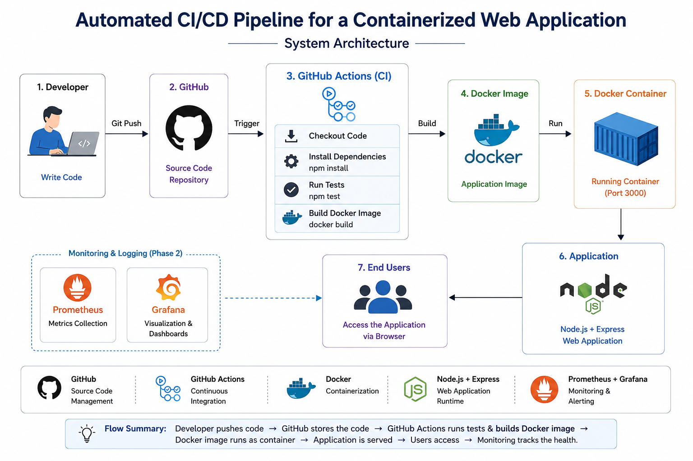

# 🚀 Automated CI/CD Pipeline for a Containerized Web Application

A DevOps internship project demonstrating Continuous Integration (CI) and Continuous Deployment (CD) using modern DevOps tools.

---

## 📌 Project Overview

This project automates the software delivery lifecycle for a Node.js web application.

It includes:

- Landing Page
- About Page
- Contact Page
- REST API
- Docker Containerization
- Automated Testing
- GitHub Actions CI Pipeline

---

## 🛠️ Tech Stack

### Frontend

- HTML5
- CSS3
- Bootstrap 5

### Backend

- Node.js
- Express.js

### DevOps

- Docker
- GitHub
- GitHub Actions

### Testing

- Jest
- Supertest

---

## 📂 Project Structure

```
automated-cicd-webapp
│
├── app.js
├── Dockerfile
├── package.json
├── README.md
├── public
├── views
├── tests
└── .github/workflows
```

---

## ▶️ Run Locally

Install dependencies

```bash
npm install
```

Start application

```bash
npm start
```

Visit

```
http://localhost:3000
```

---

## 🐳 Docker

Build Image

```bash
docker build -t cicd-webapp .
```

Run Container

```bash
docker run -d -p 3000:3000 --name cicd-container cicd-webapp
```

---

## 🧪 Run Tests

```bash
npm test
```
## System Architecture


---

## ⚙️ CI Pipeline

Whenever code is pushed to GitHub:

- Install dependencies
- Run automated tests
- Validate application

---

## 📌 Features

- Responsive Landing Page
- About Page
- Contact Page
- REST API
- Docker Support
- Automated Testing
- GitHub Actions CI

---

## 👨‍💻 Developer

**Dayanand C K**

Back-End Developer

DevOps Internship Project

2026